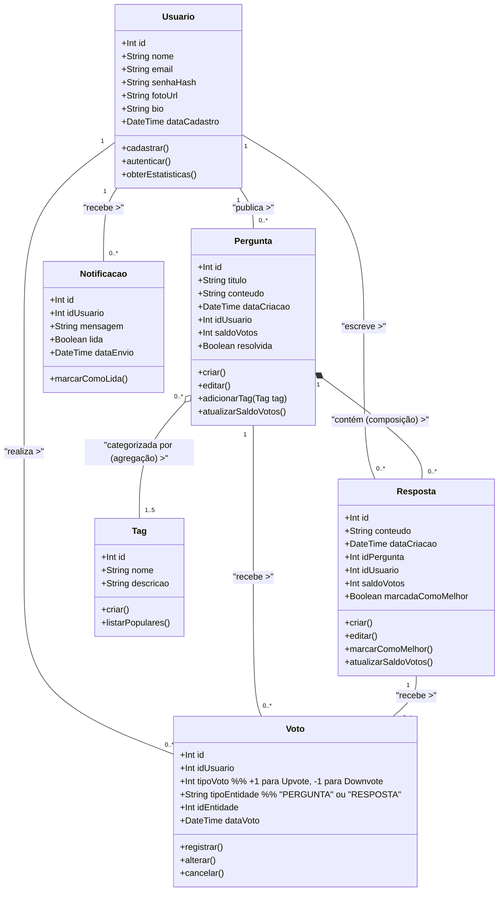
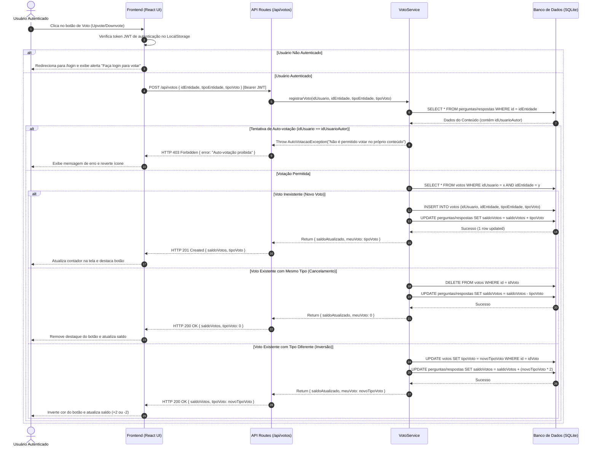
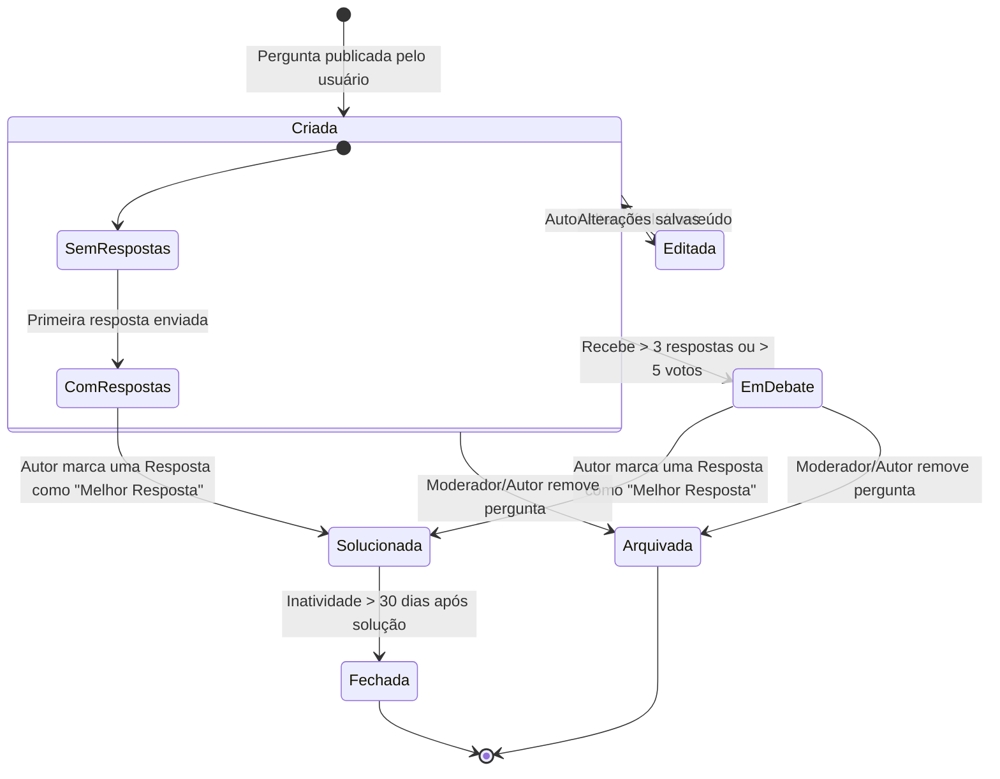

# Diagramas de Modelagem UML — ESM Forum

Este documento reúne os diagramas de modelagem técnica orientada a objetos para o sistema **ESM Forum**, elaborados com a notação **UML** utilizando a sintaxe **Mermaid** (compatível com a renderização nativa do GitHub).

---

## 1. Diagrama de Classes (Class Diagram)

O Diagrama de Classes representa a estrutura estática do domínio do **ESM Forum**, destacando as entidades de negócio, seus atributos, métodos e os relacionamentos de associação, agregação e composição.



---

## 2. Diagrama de Sequência (Sequence Diagram) — UC01: Votar em Pergunta/Resposta

O Diagrama de Sequência descreve a troca dinâmica de mensagens entre os componentes em tempo de execução para o caso de uso **UC01: Votar em Pergunta ou Resposta**.



---

## 3. Diagrama de Atividades (Activity Diagram)

O Diagrama de Atividades ilustra o fluxo de controle procedural do processo de votação, contemplando as tomadas de decisão, validações e caminhos de exceção.

```mermaid
flowchart TD
    Start([Início: Usuário clica em Votar]) --> CheckAuth{Usuário está autenticado?}
    
    CheckAuth -- Não --> Ex_Auth[Exibir Alerta: Login Necessário]
    Ex_Auth --> RedirectLogin[Redirecionar para /login]
    RedirectLogin --> End_Fail([Fim: Operação Abortada])
    
    CheckAuth -- Sim --> FetchContent[Buscar Autor do Conteúdo no BD]
    FetchContent --> CheckOwner{Usuário é o Autor do Conteúdo?}
    
    CheckOwner -- Sim --> Ex_Owner[Exibir Erro: Auto-votação Não Permitida]
    Ex_Owner --> End_Fail
    
    CheckOwner -- Não --> CheckVotoExistente{Já existe voto deste usuário para esta entidade?}
    
    CheckVotoExistente -- Não --> RegNovo[Inserir Registro na Tabela Voto]
    RegNovo --> CalcNovo[Somar tipoVoto (+1 ou -1) ao saldoVotos]
    CalcNovo --> UpdateDB[Atualizar Banco de Dados]
    
    CheckVotoExistente -- Sim --> CheckTipoVoto{O tipo do novo voto é IGUAL ao voto anterior?}
    
    CheckTipoVoto -- Sim (Cancelamento) --> DeleteVoto[Remover Registro da Tabela Voto]
    DeleteVoto --> CalcCancel[Subtrair tipoVoto do saldoVotos]
    CalcCancel --> UpdateDB
    
    CheckTipoVoto -- Não (Inversão) --> UpdateVoto[Atualizar Registro na Tabela Voto]
    UpdateVoto --> CalcInversao[Ajustar saldoVotos em +2 ou -2]
    CalcInversao --> UpdateDB
    
    UpdateDB --> RespSuccess[Retornar HTTP 200/201 com Novo Saldo]
    RespSuccess --> RenderUI[Atualizar Componente React na Tela]
    RenderUI --> End_Success([Fim: Voto Processado com Sucesso])
```

---

## 4. Diagrama de Estados (State Diagram) — Ciclo de Vida da `Pergunta`

O Diagrama de Estados mapeia as transições e os estados possíveis do objeto de domínio **Pergunta** no sistema, desde a sua criação até o encerramento.



---

## 5. Relação com a Arquitetura e Padrões de Projeto

1. **Desacoplamento e Baixo Acoplamento:** O Diagrama de Sequência demonstra a separação clara de responsabilidades entre a camada de apresentação (React UI), o roteamento HTTP e os serviços de domínio do backend.
2. **Consistência do Modelo de Dados:** O Diagrama de Classes estabelece chaves estrangeiras e cardinalidades estritas, garantindo que nenhum voto exista sem associação a um usuário e a uma entidade válida.
3. **Prevenção de Inconsistências:** O Diagrama de Atividades e de Estados garantem que a transição de saldo e regras de negócio (como proibição de auto-votação e imutabilidade de dados arquivados) sejam validadas antes de persistir o estado no banco de dados.
